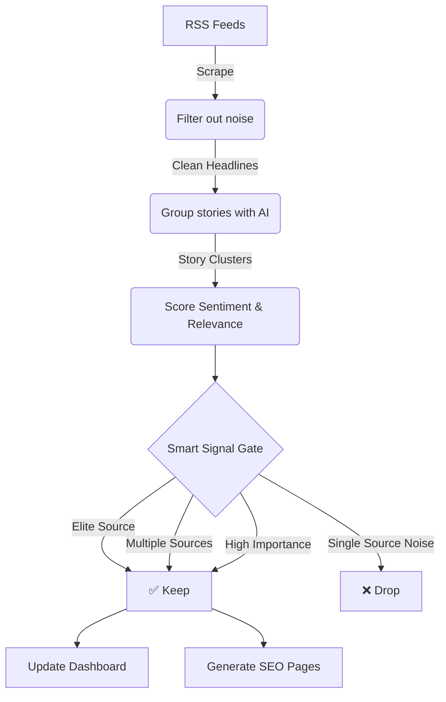

# 📰 NewsBlocks

[](https://github.com/prasadabhishek/newsblocks/actions/workflows/update-news.yml)
[](https://newsblocks.org)

NewsBlocks is a simple, visual way to see global news. It gathers headlines from major publishers, groups them into related stories using AI, and displays them as a treemap.


## How it Works

The app runs on an automated pipeline that updates every 8 hours:

1.  **Gather:** Scrapes massive RSS feeds from trusted elite sources (BBC, Reuters, FT) and Google Topic Aggregation for maximum data density.
2.  **Filter:** Removes non-news content like podcasts, editorial guides, and pricing alerts.
3.  **Group:** Uses AI embeddings to cluster similar headlines into a single "story."
4.  **Score:** Gemini AI analyzes each story for sentiment (positive/negative) and relevance.
5.  **Clean:** If a story only has one source, it's dropped unless it comes from an elite publisher or has a high relevance score.
6.  **Deploy:** Updates the dashboard and generates static search-engine-friendly pages for every story.

### The News Pipeline



## Setup & Running Locally

### 1. Requirements
- Node.js (v18+)
- A [Gemini API Key](https://aistudio.google.com/app/apikey)

### 2. Install
```bash
git clone https://github.com/prasadabhishek/newsblocks.git
cd newsblocks
npm install
```

### 3. Configure
Create a `.env` file in the root directory:
```env
GEMINI_API_KEY=your_key_here
```

### 4. Run
- **Development Server:** `npm run dev` (View at http://localhost:5173)
- **Data Update:** `node scripts/gather-news.js` (Manually run the news scraper)
- **Tests:** `npm run test` (Run the unit tests)

## Built With
- **Frontend:** React + D3.js (Responsive Treemap & Swipeable Mobile UI)
- **AI:** Google Gemini (Sentiment & Relevance Rankings)
- **Aggregator:** Massive Source Density (Google News, Reuters, BBC, TechCrunch)
- **Persistence:** Local JSON caching (improves speed and saves API costs)
- **Hosting:** Cloudflare Pages + GitHub Actions

---
