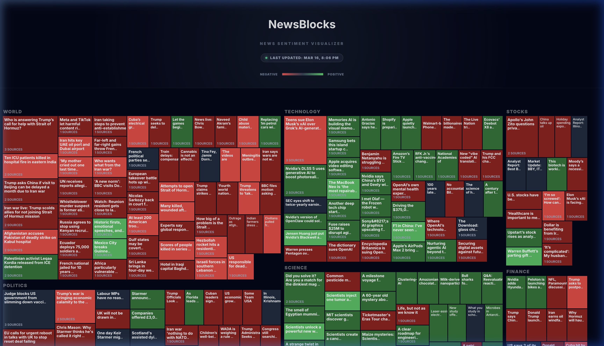

# 📰 NewsBlocks | Visual News Sentiment

[](https://github.com/prasadabhishek/newsblocks/actions/workflows/update-news.yml)
[](https://newsblocks.org)

**NewsBlocks** is a real-time, AI-powered news sentiment visualizer. It aggregates global headlines from elite journalistic sources, clusters them into semantic story-arcs using high-dimensional embeddings, and projects them into a dynamic, interactive treemap.



## 🚀 The V2 Architecture: Math over Guesswork

Unlike traditional news aggregators that rely on keyword matching or simple LLM grouping, NewsBlocks V2 uses a robust, deterministic data pipeline.

### 🧠 Semantic Story Clustering (Embeddings)
Instead of asking an AI to "group these headlines" (which leads to hallucinations and lazy catch-all categories), we use **`text-embedding-004`**.
- **Vector Space:** Every headline is converted into a 768-dimensional mathematical vector.
- **Cosine Similarity:** We calculate the mathematical distance between every headline.
- **Thresholding:** Articles are only clustered if they share a **>82% semantic similarity**. This guarantees that a cluster about "Nvidia GPU Launch" won't be polluted by general "Tech Stocks" news.

### 📊 Deterministic Sentiment (Strict Buckets)
To solve the "color fluctuation" problem where the same story might look slightly different shades of red or green every hour, we moved to a **Categorical Sentiment Model**.
- **The Buckets:** `DISASTER`, `NEGATIVE`, `NEUTRAL`, `POSITIVE`, `EUPHORIC`.
- **The Logic:** The AI classifies the *intent* and *impact* of the headline into a strict string bucket.
- **The Mapping:** Our scoring engine maps these strings to fixed, deterministic float values (`-0.9` for Disaster, `+0.9` for Euphoric). This ensures perfectly consistent coloring across the entire UI.

## 🛠️ Tech Stack

- **Frontend:** React 19, Vite, D3.js (Advanced `.join()` transitions)
- **Styling:** Vanilla CSS with custom design tokens.
- **AI Engine:** Google Gemini 2.5 Flash + Google Embeddings.
- **Automation:** GitHub Actions (Running every 8 hours on a cron schedule).
- **Deployment:** Cloudflare Pages.

## 🏃‍♂️ Running Locally

1. **Clone the repo:**
   ```bash
   git clone https://github.com/prasadabhishek/newsblocks.git
   cd newsblocks
   ```

2. **Install dependencies:**
   ```bash
   npm install
   ```

3. **Set up Environment Variables:**
   Create a `.env` file in the root:
   ```env
   GEMINI_API_KEY=your_api_key_here
   ```

4. **Run the pipeline (optional):**
   ```bash
   node scripts/gather-news.js
   ```

5. **Start the dev server:**
   ```bash
   npm run dev
   ```

## 🛡️ Security & Privacy
- **No Tracking:** NewsBlocks uses Cloudflare's privacy-first web analytics (No cookies, no GDPR banners needed).
- **Static First:** The site is served as a static asset. All AI processing happens in the background via secure GitHub Action runners, never exposing API keys to the client.

---
Made with ❤️ by [Abhishek Prasad](https://www.linkedin.com/in/abhishekaprasad/)
