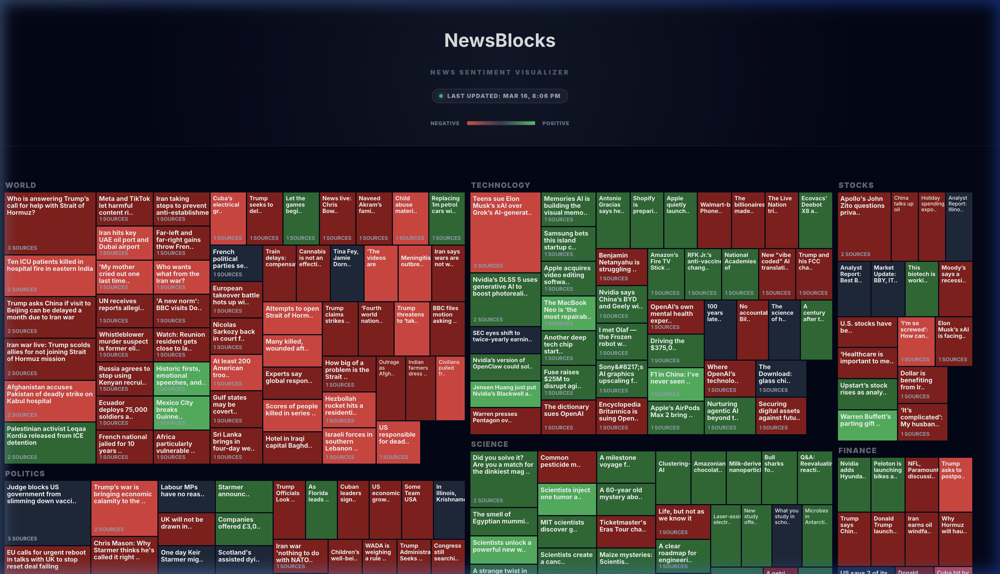
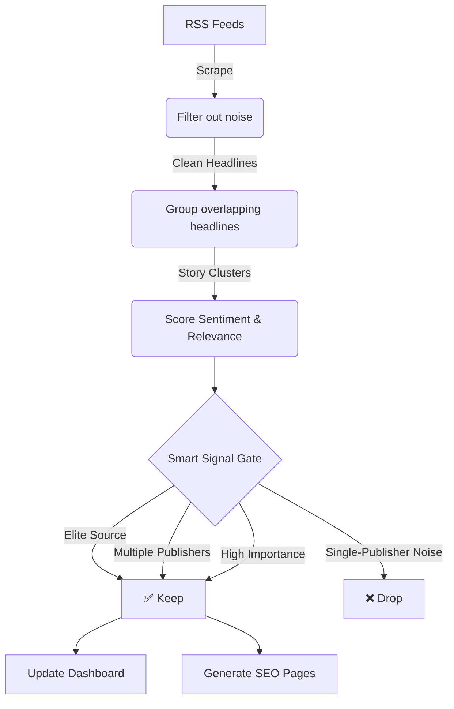

# 📰 NewsBlocks

[](https://newsblocks.org)

NewsBlocks is a simple, visual way to see global news. It gathers headlines from major publishers, groups related coverage by headline overlap, uses a local AI model for scoring, and displays the results as a treemap.



## How it Works

The Mac Mini pipeline runs every four hours:

1.  **Gather:** Reads publisher RSS feeds and Google News topic feeds.
2.  **Filter:** Removes non-news content like podcasts, editorial guides, and pricing alerts.
3.  **Group:** Matches overlapping headline terms to group related coverage.
4.  **Score:** Ollama runs Gemma 4 locally to classify category, sentiment, and relevance.
5.  **Trim:** Ranks stories by freshness, distinct-publisher coverage, and trusted-publisher representation; scores at most 120 candidates and publishes at most 100, reserving room across the six sections.
6.  **Clean:** If a story has only one publisher, it's dropped unless it comes from a tier-1 publisher or has a high relevance score.
7.  **Deploy:** Updates the dashboard and generates static search-engine-friendly pages for every published story.

### The News Pipeline


```mermaid
graph TD
    A[RSS Feeds] -->|Scrape| B(Filter out noise)
    B -->|Clean Headlines| C(Group overlapping headlines)
    C -->|Story Clusters| D(Score Sentiment & Relevance)
    D --> E{Smart Signal Gate}
    
    E -->|Elite Source| F[✅ Keep]
    E -->|Multiple Publishers| F
    E -->|High Importance| F
    E -->|Single-Publisher Noise| G[❌ Drop]
    
    F --> H[Update Dashboard]
    F --> I[Generate SEO Pages]
```

### How publisher counts work

Google News is a discovery feed, not an additional publisher. The pipeline reads the original publisher from Google's RSS source field, normalizes known aliases (for example, BBC World and BBC US both count as BBC), removes duplicate article URLs and repeated headlines from one publisher, and derives the displayed count from the remaining distinct publishers. Cached articles outside the current 24-hour window cannot support a new run. A distinct-publisher count is not proof of independently reported facts: outlets may share wire copy, so each story links to the underlying articles for inspection.

## Setup & Running Locally

### 1. Requirements
- Node.js (v18+)
- A [Gemini API Key](https://aistudio.google.com/app/apikey)

### 2. Install
```bash
git clone https://github.com/prasadabhishek/newsblocks.git
cd newsblocks
npm install
```

### 3. Configure
Create a `.env` file in the root directory:
```env
GEMINI_API_KEY=your_key_here
```

### 4. Run
- **Development Server:** `npm run dev` (View at http://localhost:5173)
- **Data Update:** `node scripts/gather-news.js` (Requires Ollama and the configured local model)
- **Tests:** `npm run test` (Run the unit tests)

## Built With
- **Frontend:** React + D3.js (Responsive Treemap & Swipeable Mobile UI)
- **AI:** Ollama with Gemma 4 for sentiment, category, and relevance
- **Aggregator:** Publisher RSS feeds and Google News topic feeds
- **Persistence:** SQLite inference and feed cache
- **Hosting:** Cloudflare Pages, updated by the Mac Mini runner

---

## Mac Mini News Runner

The Mac Mini runs the RSS gather and Ollama analysis every four hours. A successful run validates the new dataset, commits only `src/data.js`, and pushes it to `main`; Cloudflare Pages then builds the site and story pages. The runner expects the repository at `/Users/abhishekprasad/workspace/newsblocks`, Node.js 22, Ollama at `http://127.0.0.1:11434`, and the `gemma4:e4b` model. GitHub write access is provided by a repository deploy key; do not put a token in `.env` or commit credentials.

Install or refresh the runner on that Mac with:

```bash
cd /Users/abhishekprasad/workspace/newsblocks
npm ci
mkdir -p logs
cp scripts/com.newsblocks.runner.plist ~/Library/LaunchAgents/
launchctl bootstrap "gui/$(id -u)" ~/Library/LaunchAgents/com.newsblocks.runner.plist
```

The LaunchAgent runs once at login and every 14,400 seconds after that. To inspect it and its logs:

```bash
launchctl print "gui/$(id -u)/com.newsblocks.runner"
tail -f logs/runner.log logs/runner-error.log
```

To run one update manually, stop the LaunchAgent first to avoid two runs touching the same checkout:

```bash
launchctl bootout "gui/$(id -u)" ~/Library/LaunchAgents/com.newsblocks.runner.plist
node news-runner.js
```

---
